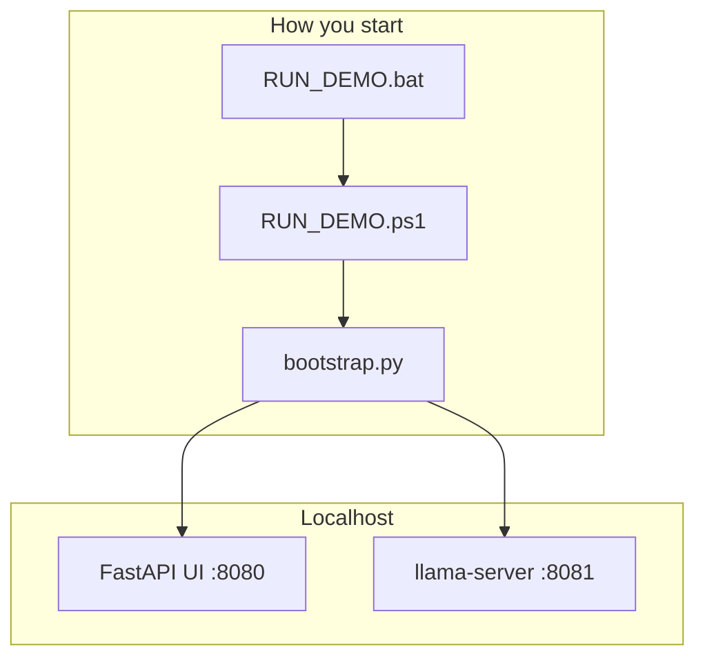

# LakanVault — Project Overview

This document explains **what connects to what**, which files matter, and how to run the demo for marking.

---

## 1. What LakanVault is

A **local AI security gateway**: a web dashboard that runs security checks before any local LLM sees your data.

- **Air-gapped by default** — nothing leaves the machine unless you enable cloud in Settings.
- **Four security features** for demo: Sanitized Chat, Model Integrity, Pipeline Scan, Audit Log.

---

## 2. Folder map (what each part does)

```
LakanVault/
├── RUN_DEMO.bat                ← START HERE (double-click)
├── README.md
│
├── config/
│   ├── default.yaml
│   └── local.yaml
│
├── demo_assets/models/
├── data/models/
├── data/audit/
├── runtime/                    ← LMS zip only (~450 MB)
│
├── docs/
│   ├── architecture/
│   └── demo/                   ← GUIDE.md, this file
│
├── scripts/
│   ├── RUN_DEMO.ps1
│   ├── setup_demo_integrity.ps1
│   ├── fetch_demo_model.ps1
│   ├── build_demo_package.ps1
│   └── run_ui.ps1              ← Dev hot-reload only
│
└── src/lakanvault/
```

---

## 3. How the pieces connect



### Startup chain

1. **`RUN_DEMO.bat`** → **`scripts/RUN_DEMO.ps1`**
2. Python 3.12+, `.venv`, `pip install -e .`
3. **`setup_demo_integrity.ps1`** → copies demo models to `data/models/`
4. **`python -m lakanvault.launcher.bootstrap`** → UI on :8080, optional llama-server on :8081

---

## 4. Ports

| Service | Port |
|---------|------|
| LakanVault UI + API | **8080** |
| Bundled llama.cpp | **8081** |
| LM Studio | 1234 |
| Ollama | 11434 |

---

## 5. LMS package

Build once:

```powershell
.\scripts\build_demo_package.ps1
```

Output: **`dist/LakanVault_DEMO.zip`**

Unzip → double-click **`RUN_DEMO.bat`**.

---

## 6. Tests

```powershell
python scripts/verify_boundaries.py
python -m pytest tests/ -q
```
